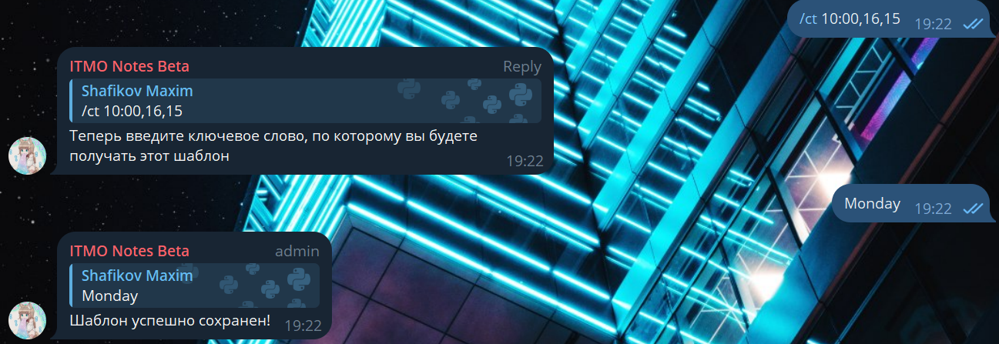

[](https://www.python.org/)
# ITMO-Tablebot

---

**ITMO-Tablebot** - telegram-бот с открытым исходным кодом предоставляющий возможности создавать таблицы для записей студентов на сдачу лабораторный работ, экзаменов и т. д.

---
Во время обучения было замечено, что на разных дисциплинах запись на сдачу тех или иных работ производилась по разному, иногда хаотично, из-за чего студенты и сами преподаватели иногда могли путаться.

В связи с этим было принято решение написать телеграм-бота, облегчающего ведение учета студентов и запись на сдачу самих работ.

---
## Как использовать?
Бота приглашают в telegram-группу, после чего человек с правами администратора данной группы может создавать, редактировать и изменять таблицы. Удобнее всего если в вашей группе есть топики, так как можно создать отдельный закрытый топик, например ```Запись на сдачу``` и создавать таблицы там, чтобы они не потерялись в чате при общении.

---
## Функционал бота:
* **Работа с таблицами**
    * Создания таблицы - ```/ml <flag[Optional]> <place> <date> <time start> <slot's count / time> <slot duration>```
    
    * Добавление слотов в таблицу  - ```/add <flag[Optional]> <time_start> <slot's count / time> <slot duration>```
    
    * Замена места проведения - ```/replace <place>```
    
    * Создание шаблона таблицы - ```/ct <flag[Optional]> <time start> <slot's count / time> <slot duration>```
    
    * Создание таблицы по шаблону - ```/mlt <place> <date>``` -> Выбрать шаблон таблицы
    
* **Запись в таблицу**
    * Регистрация в системе (записать в таблицу может только зарегистрированный пользователь) - ```/reg <name>```
    * Чтобы записаться в таблицу пользователь должен нажать на свободный слот - в нем появится его имя.
    * Если записанный пользователь нажмет на слот второй раз - его запись пропадет
    * В случае если обычный пользователь нажмет на слот, где уже записан другой человек - ничего не произойдет, только администратор может выписать пользователя из слота.
* **Логирование**
    * Администратор может запросить логи конкретного слота (например чтобы увидеть историю кто когда записывался, выписывался и удалял кого-то), для этого нужно написать команду ```/logs``` и при следующем нажатии на ячейку бот отправит пользователю логи в личные сообщения

---
## Контакты
Шафиков Максим 

**Email:** mramfix@itmo.ru

**Telegram:** https://t.me/mramfix